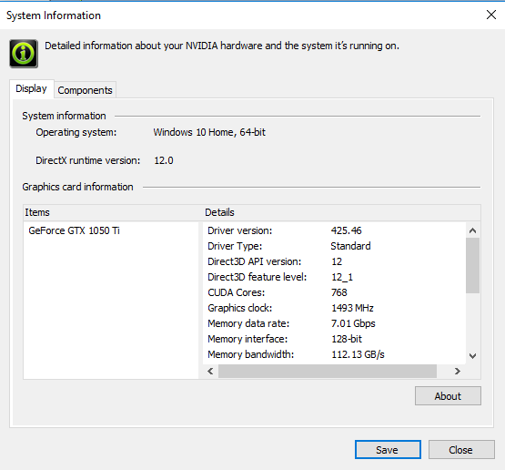
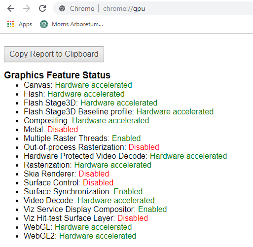
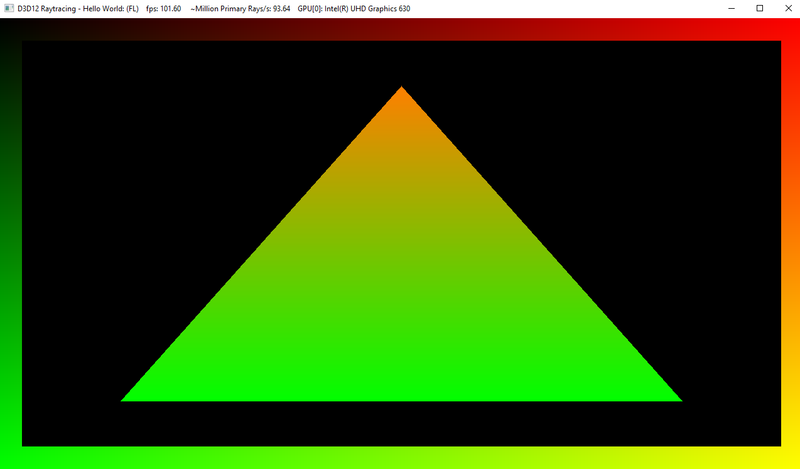
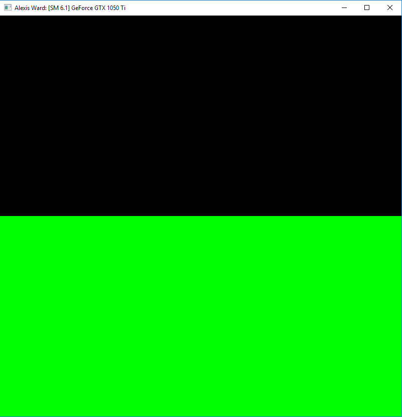
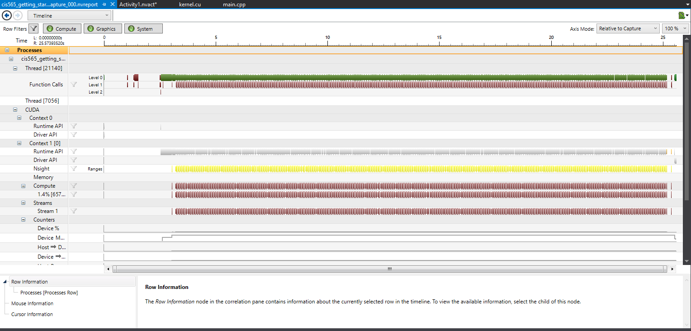
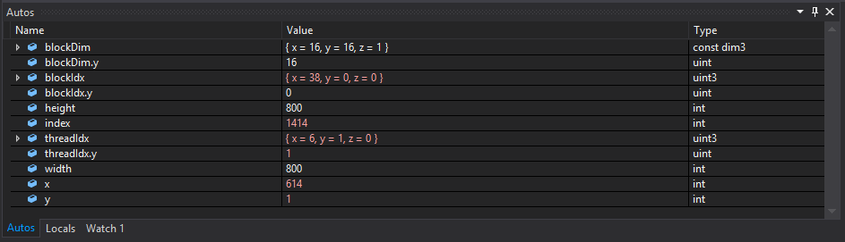
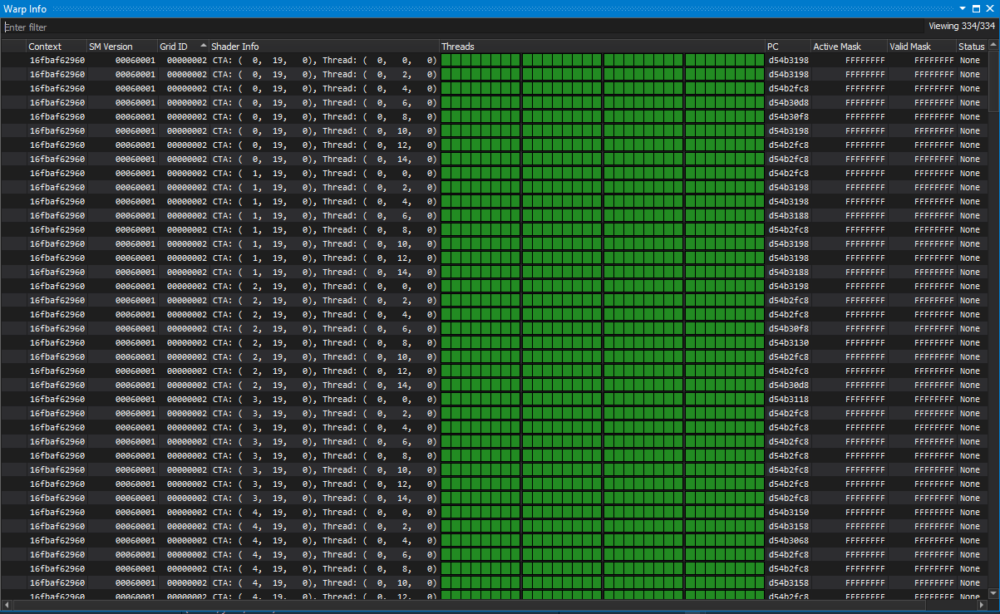

Project 0 Getting Started
====================

**University of Pennsylvania, CIS 565: GPU Programming and Architecture, Project 0**

* Alexis Ward
  * [LinkedIn](https://www.linkedin.com/in/alexis-ward47/), [personal website](https://www.alexis-ward.tech/)
* Tested on: Windows 10, i7- @ 2.22GHz 22GB, GTX 222 222MB (Moore 2222 Lab)

## README

Many of my earlier commits started on a Sig computer, but then I restarted on this one. Because of this, some of my commits come from a different account, and some commits on Tabitha Hickman's code says "aleward", since she used the lab computer after me.

### Compute Capability of CUDA-compatible GPU:
GeForce GTX 1050 Ti - Capability 6.1

### WebGL:

### Modified Triangle:

### Cuda Code Modification:

### Timeline:

### Autos Window:

### Warp Window:

